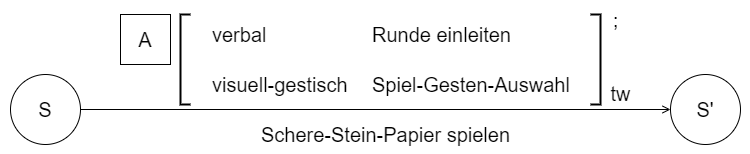

# Hands vs Hardware

Das Projekt "Hands vs Hardware" wurde im Rahmen des Praktikums im Kurs Multimodale Mensch-Maschine-Interaktion an der HTW Dresden entwickelt und dient als Leistungserbringung für den genannten Kurs. Es lief lange unter dem Arbeitstitel "Schere-Stein-Papier – eine multimodale Umsetzung" und wurde zur Finalisierung mit seinem jetzigen Titel ausgestattet.

## Anleitung zur Installation und Ausführung
### Vorraussetzung
- **Windows 10** oder höher (andere Betriebssysteme werden in der Ready-to-Use Ausführung nicht unterstützt)
- Leap Motion Controller mit installierten Treibern
- Ein gültiger Account bei [Picovoice](https://picovoice.ai) zur Nutzung der Sprachsteuerungsfunktionen

### Installation

1. **Leap Motion Treiber installieren**
   - Laden Sie die Leap Motion Treiber von der offiziellen [Website](https://leap2.ultraleap.com/downloads/leap-motion-controller/) (Account erforderlich) oder aus dem Git Repository herunter und installieren Sie diesen
   
2. **Picovoice-Account erstellen**
   - Registrieren Sie sich auf [Picovoice](https://picovoice.ai) 
   - Ein AccessKey (später benötigt) wird automatisch generiert

3. **Projekt herunterladen & starten**
   - Laden Sie den Ready-to-Use Ordner herunter
   - Entpacken Sie die .zip Datei in ein gewünschtets verzeichnis 
   - Im Ordner HandvsHardware finden sie eine gleichnamige .exe fürhen sie diese aus um das Spiel zu starten

## Dokumentation 
### AMITUDE - Modell

**(A:)** Ein Schere-Stein-Papier-Spiel **(T:)** welches gegen einen Computer gespielt wird **(E:)** an einem privaten Gaming Setup **(I:)**(**(U:)** indem der Spieler **(M:)** durch sprechen bestimmter Keyworte **(D:)** in ein Mikrofon und **(M:)** bilden einer Spielgeste **(D:)** vor einem Leap Motion Controller Eingaben zur Steuerung des Spiels tätigt)

### CROW - Modell

| **Dimension** | **Beschreibung** |
|---------------|----------------------------------------------------------------------------------------------------------------------------------------------------------------------------------------------------------------------------------------------------------------------------------------------------------------------------------------------------------------------------------------------------------------------------------------------------------------------------------------------------------------------------------------------------------------------------------------------------------------------------------------------------------------------------------------------------------------------------------------------------------------------------------------------------------------------------|
| **Character** | 
 Der Spieler ist eine technologieaffine Person, die Spaß daran hat, neue und intuitive Steuerungsmethoden zu erleben. Er besitzt eine grundlegende Vertrautheit mit dem traditionellen Spiel "Schere, Stein, Papier" und ist offen dafür, die klassische Interaktion durch multimodale Eingabemethoden wie Sprach- und Gestensteuerung zu erweitern. Körperlich gibt es keine Einschränkungen, die die Nutzung der Technologien – etwa die Handgestenerkennung durch den Leap Motion Controller – behindern könnten. Emotionen wie Neugier und Wettbewerbslust motivieren den Spieler, sich intensiv mit dem System auseinanderzusetzen. Entscheidend ist für ihn nicht nur der Sieg über den Computer, sondern auch die Freude an einer reibungslosen und innovativen Spielerfahrung.|
| **Relationship** | 
Die Beziehung zwischen dem Spieler und dem System ist überwiegend pragmatisch, aber dennoch geprägt von einer gewissen Faszination für die Technologie. Der Leap Motion Controller und das Mikrofon sind Werkzeuge, die dem Spieler helfen, auf eine neue Weise mit dem Computer zu interagieren. Der Spieler hat keine persönliche Bindung zu den Geräten, doch er schätzt ihre Zuverlässigkeit und die Präzision bei der Erkennung seiner Eingaben. Es besteht eine gewisse Erwartungshaltung, dass das System akkurat arbeitet, insbesondere bei der Verarbeitung von Sprach- und Gesteneingaben. Da das Spiel gegen den Computer stattfindet, gibt es keine direkte Interaktion mit anderen Menschen, wobei das System den Computergegner durch optische Rückmeldungen wie visuelle Darstellungen auf dem Bildschirm repräsentiert.|
| **Objective** | 
Das primäre Ziel des Spielers besteht darin, den Computergegner in einer Runde "Schere, Stein, Papier" zu schlagen. Gleichzeitig möchte der Spieler die multimodale Steuerung erleben und testen, wie intuitiv und zuverlässig das System auf seine Eingaben reagiert. Dabei geht es nicht nur um das Spielergebnis, sondern auch um das Gefühl, mit einer neuen Technologie erfolgreich zu interagieren. Auf Seiten des Systems ist das Ziel, die Eingaben des Spielers – seine gesprochene Signale ("Schere-Stein-Papier" oder "Schnick-Schnack-Schnuck") und die Gesten – präzise zu erkennen, die Wahl des Computers zufällig zu generieren und das Ergebnis klar und verständlich auf dem Bildschirm darzustellen.|
| **Where** |  
 Die Interaktion findet in einer ruhigen, kontrollierten Umgebung statt, beispielsweise in einem privaten Raum oder in einem Labor. Der Desktop-PC, der als zentrales Element des Systems dient, steht auf einem stabilen Tisch, zusammen mit dem Leap Motion Controller, der so positioniert ist, dass er bequem die Handgesten des Spielers erfassen kann. Das Mikrofon ist ebenfalls in Reichweite, entweder integriert im Setup oder separat als Headset oder Tischmikrofon vorhanden. Die Lichtverhältnisse sind optimiert, um die Gestenerkennung zu unterstützen. Die Umgebung ist frei von lauten Geräuschen oder Ablenkungen, um die Spracherkennung nicht zu beeinträchtigen. Der Spieler sitzt oder steht bequem vor dem Setup, konzentriert sich ausschließlich auf das Spiel und hat keine weiteren Aufgaben oder Ablenkungen.|

 

### Storyboard

 

### CARE - Modell

### Ablaufplan
#### Spiel

#### Emotionen Bot

### Quellen 
#### Musik
   - ???

> Ein Projekt von Tobias Friese, Gregor Hens und Markus Niebisch 